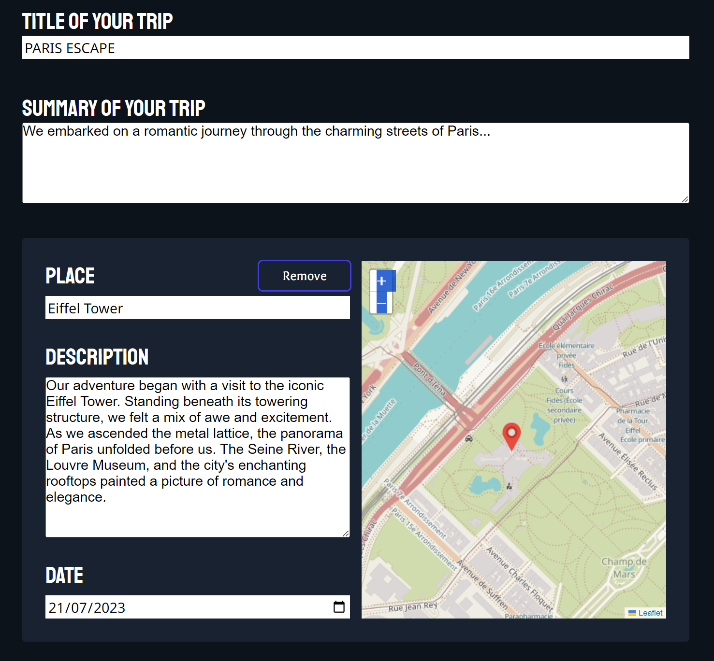
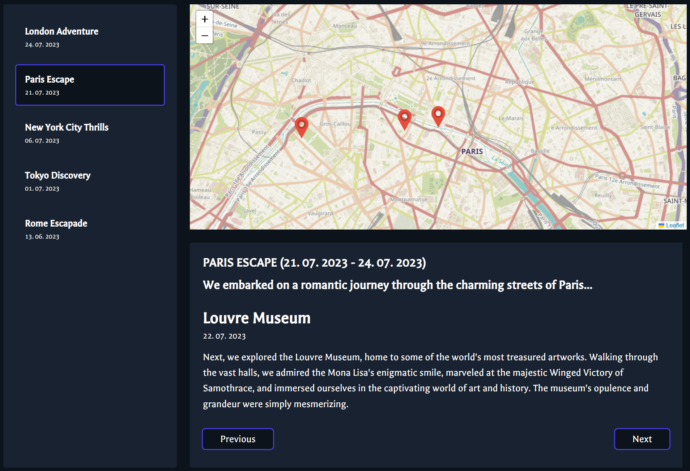

# Travelology
Travelology is the perfect companion app for avid travelers, allowing them to catalog their journeys with detailed descriptions and easily mark their favorite spots on a map.

## Technologies Used
- **Frontend**: React.js, Leaflet
- **Backend**: Express.js
- **Database**: MongoDB

## Key Features
### Account Management and Authentication
Travelology provides users with the ability to create, update, and delete accounts, manage passwords, and choose from various map providers, along with options for light and dark themes.

### Create Trips
In the Create section, users can create new trips and add multiple locations they've visited during their journeys. Each location encompasses a description, date, and can be precisely pinpointed on the map.

### View Trips
The Map section showcases all the trips, presenting a comprehensive map with markers representing each visited location. Clicking on a marker reveals the specific place's description and automatically centers the marker on the map. Alternatively, users can navigate between locations using the Next or Previous buttons below the descriptions.

## Try It Out
[Demo app](https://travelology-af.netlify.app/welcome) already has an email and password provided for you, so you can explore the functionalities of the app. 